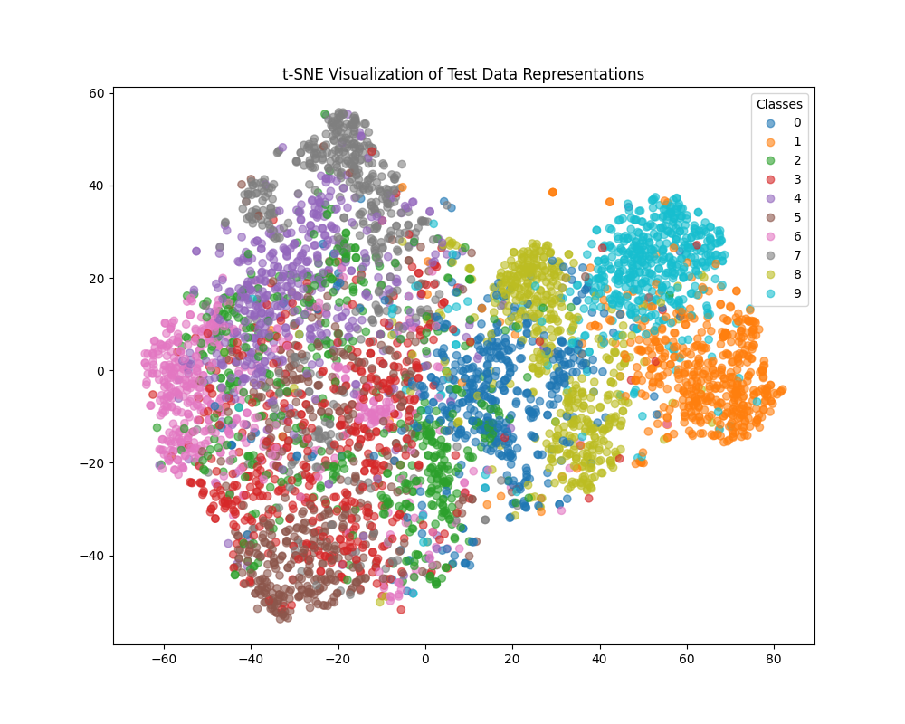
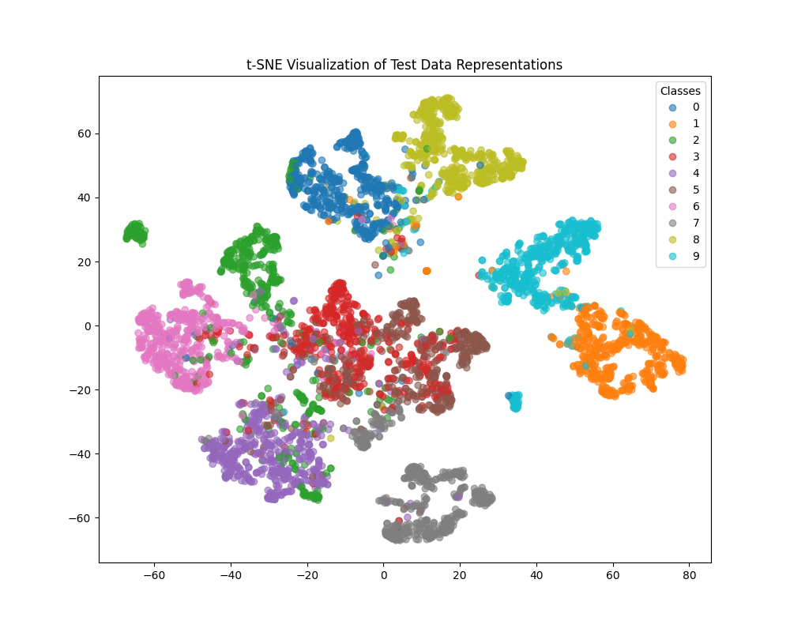

# Improving Self-Supervised Representations via Dimensional Contrastive Learning in BYOL

Student: Albert Khazipov \
Group: B21-DS-01 \
Email: a.khazipov@innopolis.university

This repository contains the code and experiments for the thesis "Improving Self-Supervised Representations via Dimensional Contrastive Learning in BYOL". The project investigates the integration of Dimensional Contrastive Learning (DimCL) as a regularizer into the Bootstrap Your Own Latent (BYOL) self-supervised learning framework to enhance feature diversity and representation quality.

## Setup

1.  **Clone the repository:**
    ```bash
    git clone https://github.com/1khazipov/BYOL
    cd BYOL
    ```

2.  **Create a virtual environment (recommended):**
    ```bash
    conda create -n byol python=3.10.14
    conda activate byol
    ```

3.  **Install dependencies:**
    ```bash
    pip install -r requirements.txt
    ```
    *Note: Ensure you have a compatible version of PyTorch installed for CUDA environment.*

4.  **Download Datasets:** The scripts will attempt to download CIFAR-10/100 automatically if they are not found in the `./datasets` directory.

5.  **Download Pre-trained Models:**
    *   The pre-trained model weights used for evaluation (e.g., `model-final.pt` or `model-<epoch>.pt`) are not stored in this repository due to their size.
    *   Download the models from the following link: `https://drive.google.com/drive/folders/1FRYR6p2vqvSdlQxeSoPWBwxxIycXdwnn?usp=drive_link`
    *   Place the downloaded model files in the root directory of the project or specify their path using the `--model_path` argument during evaluation.

## Usage

### 1. Self-Supervised Pre-training (`main.py`)

This script performs the BYOL or BYOL+DimCL pre-training on the specified dataset using the chosen backbone. Distributed training is supported.

**Example Command (Single GPU, ResNet-18, BYOL+DimCL on CIFAR-10):**

```bash
python main.py \
    --batch_size 64 \
    --num_epochs 100 \
    --loss_type byol_loss or dimcl_loss \
    --model_type resnet18 or vit \
    --dataset cifar10 or cifar100 \
    --learning_rate 3e-4 \
    --dataset_dir ./datasets \
    --checkpoint_epochs 10 \
```

*   **Output:** The script will save model checkpoints (e.g., `model-<epoch>.pt`) and TensorBoard logs. The final model will be saved as `model-final.pt`.

### 2. Linear Evaluation and t-SNE Visualization (`logistic_regression.py`)

This script evaluates a pre-trained encoder by training a linear classifier on top of its frozen features and generates a t-SNE visualization.

**Example Command:**

IMPORTANT: If you used the classification before, you should delete `features.p`:
```bash
rm features_<algorithm_name>.p
```

```bash
python logistic_regression.py \
    --model_path ./model-final.pt \
    --model_type resnet18 or vit \
    --dataset cifar10 or cifar100 \
    --batch_size 768 \
    --num_epochs 300 \
    --learning_rate 3e-3 \
    --dataset_dir ./datasets \
```

*   **Output:**
    *   Prints the final linear probing accuracy to the console.
    *   Saves a t-SNE visualization plot as `test_tsne.png` in the root directory.
    *   Saves intermediate feature files (`features.p`) to speed up subsequent runs.

## Results

Experimental results, including comparison tables and t-SNE plots for different configurations, can be found in the `./results/` and `./runs/` directories:
```bash
tensorboard --logdir runs
```

## Results on CIFAR-10 plot:
Baseline:

Best result:


## Results on CIFAR-100 classification:
| Model      | Loss Function   | Dataset  | Accuracy  |
|------------|-----------------|----------|----------:|
| ResNet-18  | BYOL Loss       | CIFAR-10 |   82.9%   |
| ResNet-18  | DimCL+BYOL Loss | CIFAR-10 |   82.1%   |
| ViT-B/16   | BYOL Loss       | CIFAR-10 |   85.4%   |
| **ViT-B/16** | **DimCL+BYOL Loss** | **CIFAR-10** | **93.4%** |

## Project Structure

```
.
├── main.py                 # Main script for self-supervised pre-training
├── logistic_regression.py  # Script for linear evaluation and t-SNE visualization
├── process_features.py     # Helper functions for feature processing
├── modules/                  # Core algorithm modules
│   ├── __init__.py
│   ├── byol.py             # BYOL and BYOL+DimCL implementation
│   └── transformations/
│       ├── __init__.py
│       └── simclr.py       # Augmentations used by BYOL
├── results/                # Directory containing experiment results (e.g., t-SNE plots, logs)
├── requirements.txt        # Project dependencies
└── README.md               # This file
```
